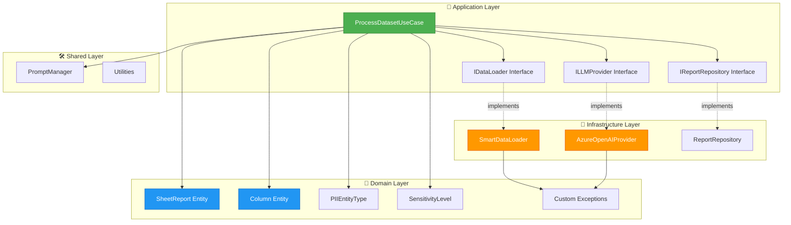
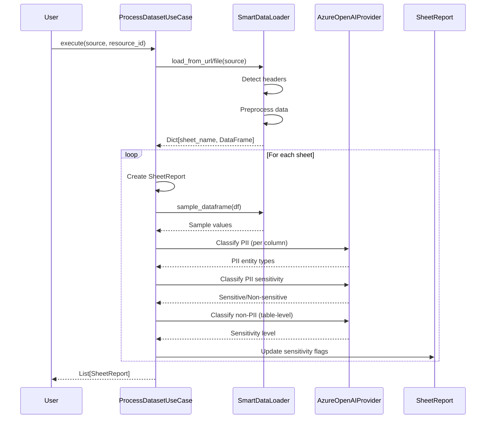

# HDX Sensitive Data Detection Pipeline

A production-ready, clean architecture pipeline for detecting and classifying sensitive data in humanitarian datasets using Azure OpenAI.

[](tests/)
[](htmlcov/)
[](https://www.python.org/)
[](LICENSE)

## 🎯 Overview

This pipeline automatically analyzes datasets to identify:
- **PII (Personally Identifiable Information)**: Names, emails, phone numbers, addresses, etc.
- **PII Sensitivity**: Whether detected PII is actually sensitive in context
- **Non-PII Sensitivity**: Overall data sensitivity based on Information Sensitivity Protocols (ISP)

### Key Features

✅ **Clean Architecture** - Separation of concerns with domain-driven design  
✅ **97% Test Coverage** - Comprehensive unit and integration tests  
✅ **Smart Data Loading** - Automatic header detection and preprocessing  
✅ **Multi-Model Support** - Use different LLM models for different tasks  
✅ **ISP Integration** - Country-specific sensitivity rules  
✅ **Production Logging** - Professional logging at all levels  
✅ **Type Safety** - Full type hints throughout codebase  

---

## 🏗️ Architecture

The pipeline follows **Clean Architecture** principles with clear separation between layers:



### Processing Pipeline Flow



---

## 📦 Project Structure

```
hdx-ssd-pipeline/
├── src/
│   ├── application/          # Application business logic
│   │   ├── interfaces/       # Abstract interfaces (ports)
│   │   │   ├── data_loader.py
│   │   │   ├── llm_provider.py
│   │   │   └── report_repository.py
│   │   └── use_cases/        # Use case orchestration
│   │       └── process_dataset.py
│   │
│   ├── domain/               # Core business domain
│   │   ├── entities/         # Business entities
│   │   │   ├── column.py
│   │   │   ├── sheet_report.py
│   │   │   ├── pii_classification.py
│   │   │   └── non_pii_classification.py
│   │   ├── value_objects/    # Immutable value objects
│   │   │   ├── entity_type.py
│   │   │   └── sensitivity.py
│   │   └── exceptions.py     # Domain exceptions
│   │
│   ├── infrastructure/       # External implementations
│   │   ├── llm/
│   │   │   └── azure_openai_provider.py
│   │   └── storage/
│   │       └── data_loader.py
│   │
│   ├── shared/               # Shared utilities
│   │   └── utils/
│   │       └── prompt_manager.py
│   │
│   └── prompts/              # LLM prompt templates
│       ├── pii_detection/
│       ├── pii_reflection/
│       └── non_pii_classification/
│
├── tests/                    # Comprehensive test suite
│   ├── unit/                 # Unit tests (97% coverage)
│   └── integration/          # Integration tests
│
├── docs/                     # Documentation
├── data/                     # ISP rules and configs
├── tutorial.py               # Usage examples
└── README.md                 # This file
```

---

## 🚀 Quick Start

### Prerequisites

- Python 3.10+
- Azure OpenAI API access
- pip or conda for package management

### Installation

1. **Clone the repository**
```bash
git clone https://github.com/OCHA-DAP/hdx-ssd-pipeline.git
cd hdx-ssd-pipeline
```

2. **Install dependencies**
```bash
pip install -r requirements.txt
```

3. **Configure environment variables**
```bash
cp .env.example .env
# Edit .env with your Azure OpenAI credentials
```

Required environment variables:
```bash
AZURE_OPENAI_API_KEY=your_api_key
AZURE_OPENAI_ENDPOINT=https://your-endpoint.openai.azure.com/

# Model names (can use different models for each task)
PII_DETECT_MODEL=gpt-4.1-nano
PII_REFLECT_MODEL=gpt-4.1-nano
NON_PII_DETECT_MODEL=gpt-4.1-nano
```

### Basic Usage

```python
from src.application.use_cases.process_dataset import ProcessDatasetUseCase
from src.infrastructure.llm.azure_openai_provider import AzureOpenAIProvider
from src.infrastructure.storage.data_loader import SmartDataLoader
from src.shared.utils.prompt_manager import PromptManager
import os

# 1. Setup components
data_loader = SmartDataLoader(max_rows=1000)

pii_llm = AzureOpenAIProvider(
    model_name=os.getenv('PII_DETECT_MODEL'),
    azure_endpoint=os.getenv('AZURE_OPENAI_ENDPOINT'),
    api_key=os.getenv('AZURE_OPENAI_API_KEY'),
)

# 2. Create use case
pipeline = ProcessDatasetUseCase(
    data_loader=data_loader,
    pii_llm_provider=pii_llm,
    pii_reflection_llm_provider=pii_llm,
    non_pii_llm_provider=pii_llm,
    prompt_manager=PromptManager(),
    sample_size=5
)

# 3. Process a dataset
reports = pipeline.execute(
    source="path/to/data.xlsx",
    resource_id="dataset-123",
    is_url=False
)

# 4. Access results
for report in reports:
    print(f"Sheet: {report.sheet_name}")
    print(f"Sensitive: {report.is_sensitive()}")
    print(f"PII Columns: {len([c for c in report.columns if c.has_pii()])}")
```

See [`tutorial.py`](tutorial.py) for more comprehensive examples.

---

## 🧪 Testing

The project has **97% test coverage** with 190 passing tests.

```bash
# Run all tests
pytest

# Run with coverage report
pytest --cov=src --cov-report=html

# Run specific test file
pytest tests/unit/test_process_dataset_use_case.py -v

# Run with detailed output
pytest -vv --tb=short
```

### Test Structure

- **Unit Tests** (`tests/unit/`): Test individual components in isolation
- **Integration Tests** (`tests/integration/`): Test component interactions
- **Fixtures** (`tests/fixtures/`): Reusable test data and mocks

---

## 🎨 Key Components

### 1. ProcessDatasetUseCase

The main orchestrator that coordinates the entire pipeline:

```python
class ProcessDatasetUseCase:
    """
    Main use case for processing a complete dataset.
    
    Pipeline steps:
    1. Load data from URL or file
    2. Create sheet reports
    3. Classify PII (per column)
    4. Reflect on PII sensitivity
    5. Classify non-PII (table-level)
    6. Update sensitivity flags
    """
```

**Features:**
- ⏱️ Performance timing and metrics
- 📊 Progress tracking
- 🔄 Multi-sheet processing
- 🛡️ Comprehensive error handling
- 📝 Professional logging

### 2. SmartDataLoader

Intelligent data loading with automatic preprocessing:

```python
class SmartDataLoader(IDataLoader):
    """
    Smart data loader with automatic preprocessing.
    
    Features:
    - Loads from URLs or local files
    - Handles CSV, Excel (XLS, XLSX)
    - Detects and concatenates multi-row headers
    - Handles multiple sheets
    - Smart sampling (most complete rows first)
    """
```

**Capabilities:**
- 🎯 Automatic header detection
- 🔄 Multi-row header concatenation
- 🧹 Empty row/column filtering
- 📊 Data quality metrics
- 🚀 Optimized sampling

### 3. AzureOpenAIProvider

Production-ready LLM integration:

```python
class AzureOpenAIProvider(ILLMProvider):
    """
    Azure OpenAI implementation with:
    - Text and JSON generation
    - Token usage tracking
    - Performance warnings
    - Comprehensive error handling
    """
```

**Features:**
- 🔐 Secure authentication
- 📊 Token usage monitoring
- ⚠️ High usage warnings
- 🐛 Detailed error logging
- 🎯 JSON response validation

### 4. Domain Entities

**SheetReport**: Represents a complete analysis of a dataset sheet
```python
@dataclass
class SheetReport:
    resource_id: Optional[str]
    file_name: str
    sheet_name: str
    columns: List[Column]
    pii_classification: PIIClassification
    non_pii_classification: NonPIIClassification
    # ... and more
```

**Column**: Represents a single column with its classifications
```python
@dataclass
class Column:
    name: str
    sample_values: List[Any]
    pii_classification: PIIClassification
```

---

## 📊 Logging

The pipeline includes professional logging at all levels:

### Log Levels

- **DEBUG**: Detailed diagnostic information
  - Request/response details
  - Data transformation steps
  - Token usage per request

- **INFO**: General informational messages
  - Pipeline progress
  - File loading success
  - Processing completion

- **WARNING**: Warning messages
  - High token usage
  - Data quality issues
  - Missing optional data

- **ERROR**: Error messages
  - API failures
  - Data processing errors
  - Validation failures

### Example Log Output

```
2026-01-17 12:30:00 - INFO - Starting dataset processing: source=data.xlsx, resource_id=123
2026-01-17 12:30:01 - INFO - Loading data from file: data.xlsx
2026-01-17 12:30:01 - DEBUG - File type: Excel, size: 245.32 KB
2026-01-17 12:30:02 - DEBUG - Found 3 sheet(s): ['Sheet1', 'Sheet2', 'README']
2026-01-17 12:30:02 - INFO - Processing sheet 1/3: 'Sheet1' (150 rows, 12 columns)
2026-01-17 12:30:03 - DEBUG - Generating text: model=gpt-4.1-nano, max_tokens=8, prompt_length=245
2026-01-17 12:30:04 - DEBUG - Generation successful: completion_tokens=5, prompt_tokens=240, total_tokens=245
2026-01-17 12:30:10 - INFO - Successfully processed 3 sheet(s) in 10.23s, total_tokens=1,234
```

---

## 🔧 Configuration

### ISP Rules

Information Sensitivity Protocol rules can be customized per country/context:

```json
{
  "default": {
    "country": "Global",
    "rules": {
      "location_data": "MODERATE_SENSITIVE",
      "demographic_data": "MODERATE_SENSITIVE",
      "health_data": "HIGH_SENSITIVE"
    }
  },
  "Ukraine": {
    "country": "Ukraine",
    "rules": {
      "location_data": "HIGH_SENSITIVE",
      "demographic_data": "MODERATE_SENSITIVE",
      "health_data": "SEVERE_SENSITIVE"
    },
    "context": "Humanitarian crisis - extra caution required"
  }
}
```

### Model Configuration

You can use different models for different tasks:

```python
# Use faster model for PII detection
pii_llm = AzureOpenAIProvider(model_name="gpt-4.1-nano", ...)

# Use more capable model for sensitivity assessment
non_pii_llm = AzureOpenAIProvider(model_name="gpt-4.1-mini", ...)
```

---

## 📈 Performance

### Optimization Tips

1. **Use `gpt-4.1-nano`** for faster, cheaper processing
2. **Adjust `sample_size`** (default: 5) based on data variability
3. **Set `max_rows`** limit for very large files
4. **Batch process** multiple files for efficiency

---

### Development Setup

```bash
# Install development dependencies
pip install -r requirements-dev.txt

# Run tests with coverage
pytest --cov=src --cov-report=html

# Format code
black src/ tests/
isort src/ tests/

# Type checking
mypy src/
```

---

## 🗺️ Roadmap

- [ ] Add support for additional LLM providers (OpenAI, Anthropic)
- [ ] Implement caching for repeated classifications
- [ ] Add web UI for interactive analysis
- [ ] Support for streaming large files
- [ ] Multi-language support for prompts
- [ ] Real-time processing API
- [ ] Integration with HDX platform

---
